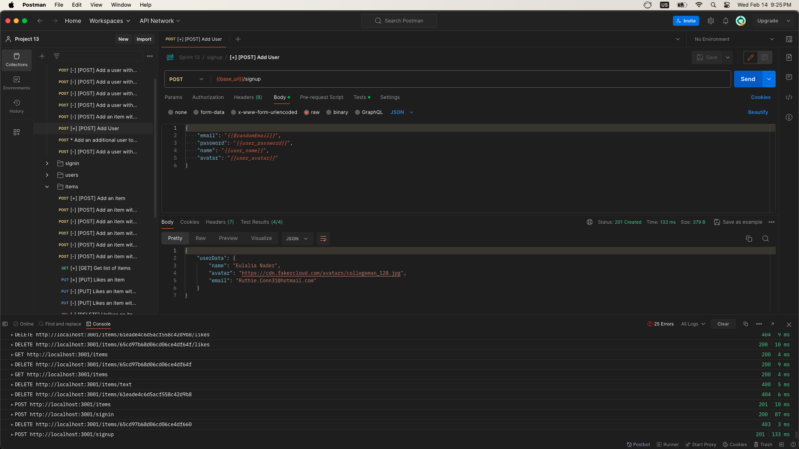
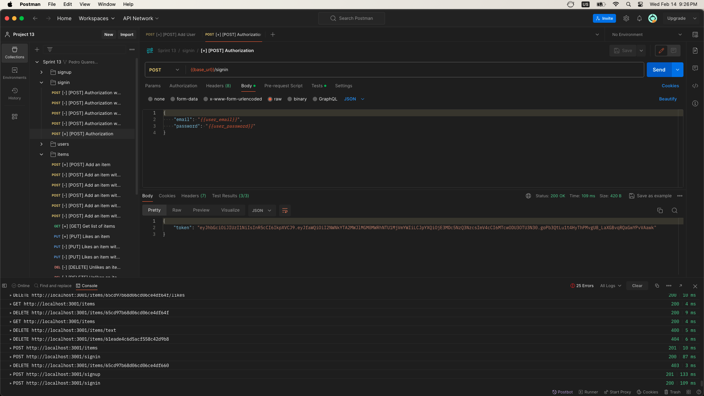
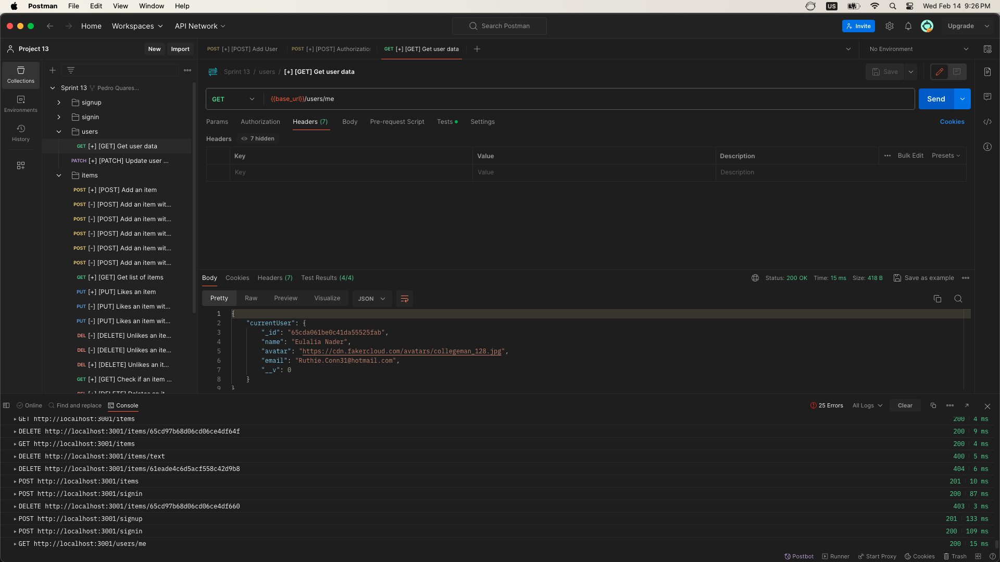
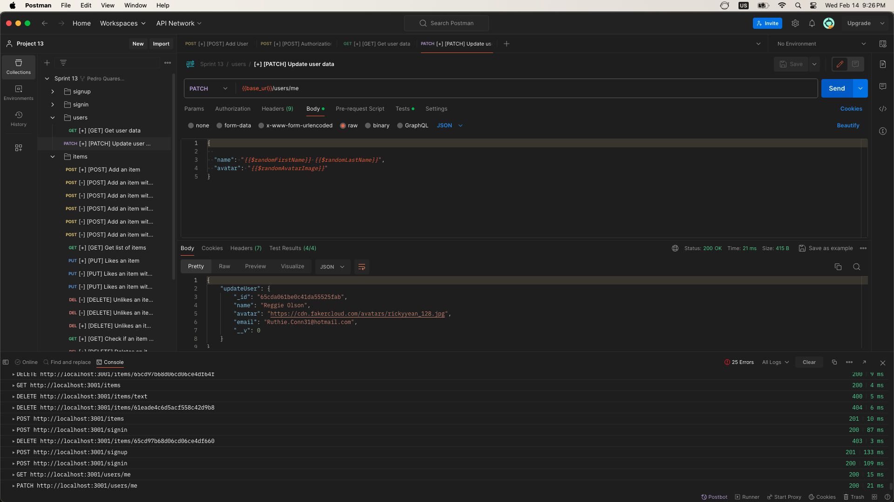
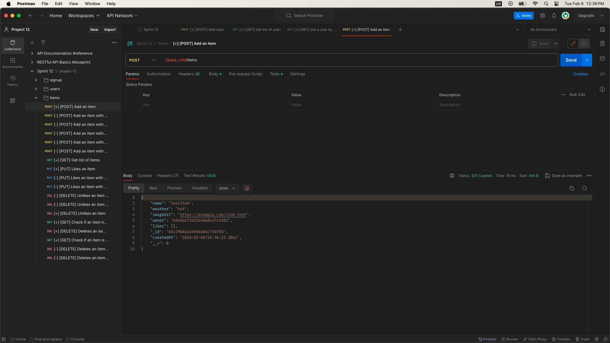
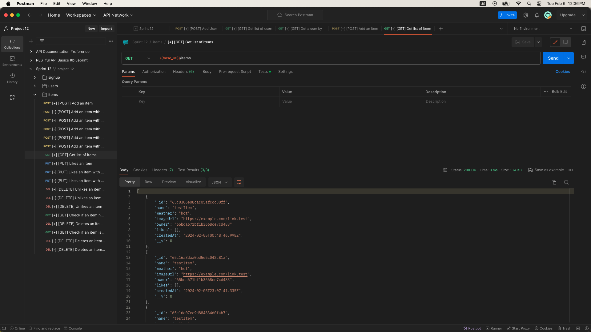
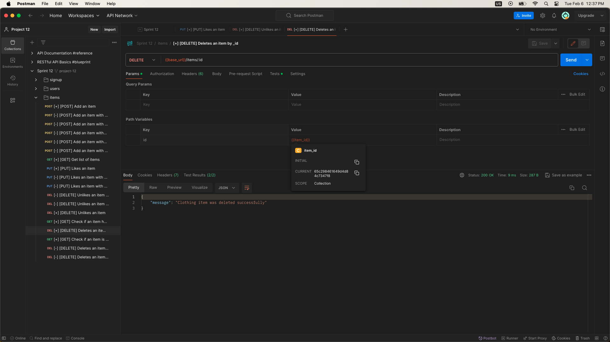
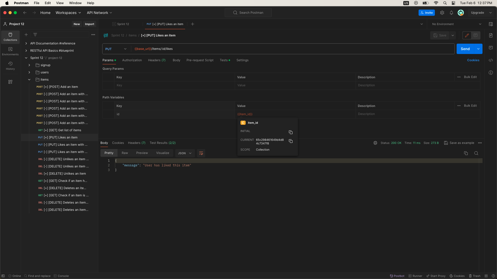
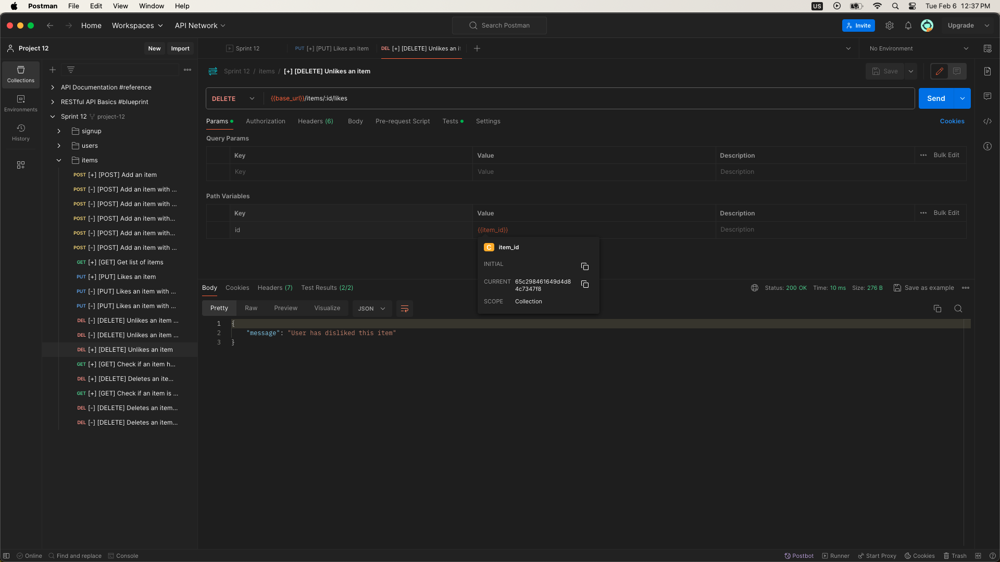

# WTWR (What to Wear?): Back End

The WTWR Back End project aims to provide the server-side functionality for the WTWR application. Through this project, you will delve into database management, security implementation, and testing practices, while also learning how to deploy web applications on remote servers. The ultimate objective is to establish a server equipped with a robust API and user authentication capabilities.

## Functionality

- Set up a server to manage API requests from the WTWR application.
- Implement database management to store user profiles and clothing item recommendations.
- Develop error handling mechanisms to address and respond to common error scenarios, including invalid input, bad requests, and server-side failures.
- Ensure required fields are provided, validate email formats, and enforce password complexity.
- Handle duplicate email errors and other validation failures gracefully.
- Create middleware to authenticate users before allowing access to protected routes.
- Validate JWT tokens provided in the request headers to ensure users are authorized to access protected resources.
- Handle unauthorized access gracefully, returning a 401 Unauthorized error to clients.

## Project Features

### User Route:

- **SignUp:**
  
- **SignIn:**
  
- **Get User Profile:**
  
- **Update User Profile:**
  

### Clothing Item Route:

- **Create an Item:**
  
- **Find All Items:**
  
- **Delete an Item:**
  
- **Like an Item:**
  
- **Dislike an Item:**
  

## Technologies and Techniques Used

- **Node.js:** Primary runtime environment for executing JavaScript code on the server.
- **Express.js:** Web application framework for Node.js used to simplify API development.
- **MongoDB:** NoSQL database management system employed for storing and managing user data.

## Running the Project

- `npm run start` — Launches the server.
- `npm run dev` — Launches the server with hot reload functionality.

## Project Domain

- [Project Domain Link Page](https://pedrowtwr.jumpingcrab.com/)
