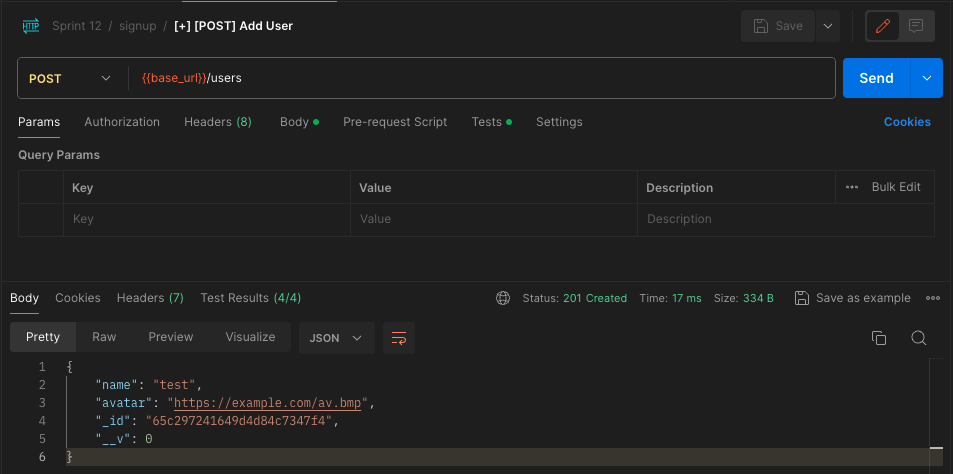
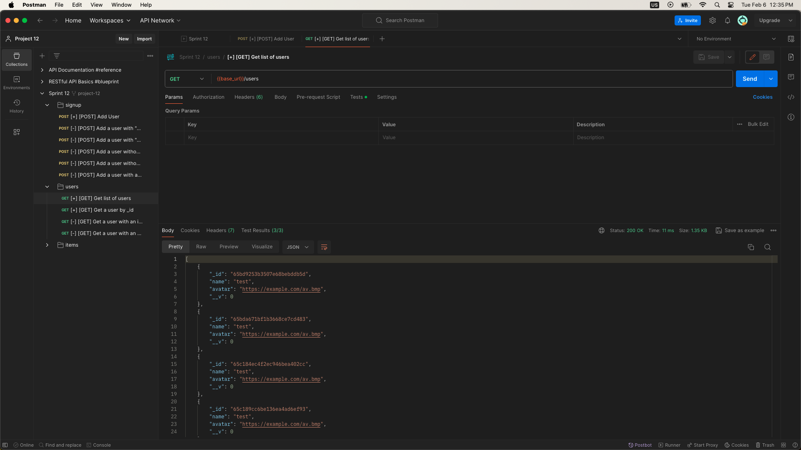
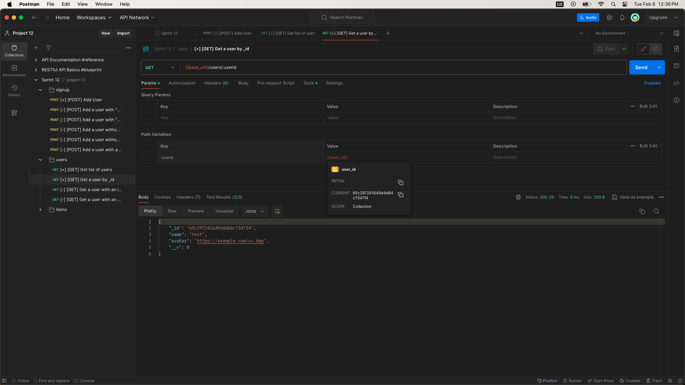

# WTWR (What to Wear?): Back End

The back-end project is focused on creating a server for the WTWR application. You’ll gain a deeper understanding of how to work with databases, set up security and testing, and deploy web applications on a remote machine. The eventual goal is to create a server with an API and user authorization.

# Functionality

- Create a server to handle API requests from the WTWR application.
- Set up database management for storing user profiles and clothing items recommendations.
- Develop error handling functionality to manage and respond to common errors scenarios such as invalid input, bad request and server-side failures.

# Project Features

- User Route:
  - Create an user
    
  - Find all users
    
  - Find a user by ID
    
- Clothing Item Route:
  - Create an item
    
  - Find all items
    
  - Delete an item
    
  - Like an item
    
  - Dislike an item
    

# Technologies and Techniques Used

- Node.js: Utilized as the primary runtime environment for executing JavaScript code on the server.
- Express.js: A web application framework for Node.js used to simplify the creation of robust APIs.
- MongoDB: A NoSQL database management system employed for storing and managing user data.

## Running the Project

`npm run start` — to launch the server

`npm run dev` — to launch the server with the hot reload feature

### Testing

Before committing your code, make sure you edit the file `sprint.txt` in the root folder. The file `sprint.txt` should contain the number of the sprint you're currently working on. For ex. 12
